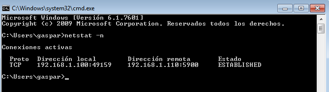

# Tema: Acceso Remoto VNC
___

## 1.Windows: Slave VNC
  * Crearemos una MV de Windows y la configuraremos. En este caso tendrá la IP  `192.168.1.100` ya que esta practica la trabaje en casa.
  * Descargaremos e instalaremos `TightVNC`.
  

  * Luego elegimos la opcion `TightVNC -> Custom -> Server`Esto es el servicio.
  

  * Permitiremos acceso al cortafuegos.

### 1.2 Comprobación desde una máquina GNU/Linux
  - Ejecutaremos `nmap -Pn 192.168.1.100` desde una maquina OpenSuse para comprobar que los servicios son visibles desde fuera.

___

## 2.Windows: Master VNC
  - Ahora vamos a aprovechar la anterior MV que ya esta configurada y la clonamos, cambiando la ip a  `192.168.1.110`.
  - Descargaremos e instalaremos `TightVNC > Custom > Viewer`.

### 2.1 Comprobaciones finales
- Conectar desde Windows Master hacia Windows Slave

- Una vez hecha la conexión nos dirigimos al servidor VNC y utilizamos el comando el comando `netstat -n` para ver las conexiones VNC con el cliente.

