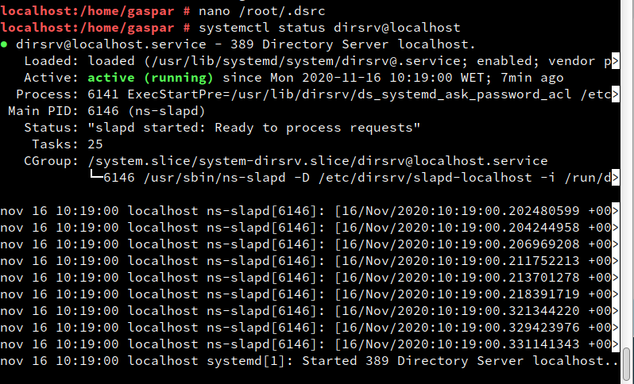
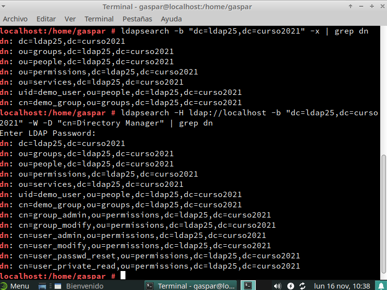
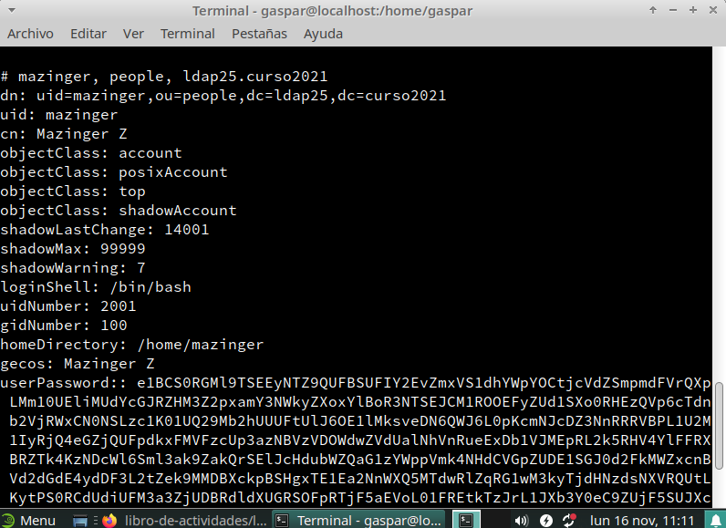
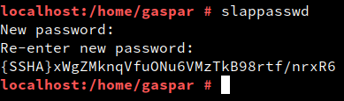
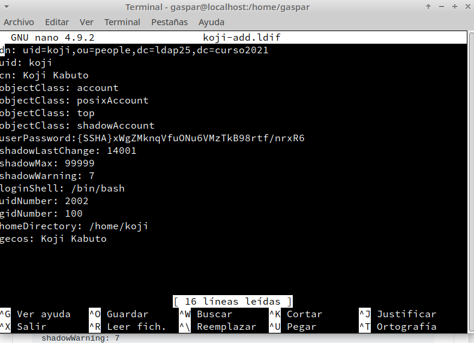
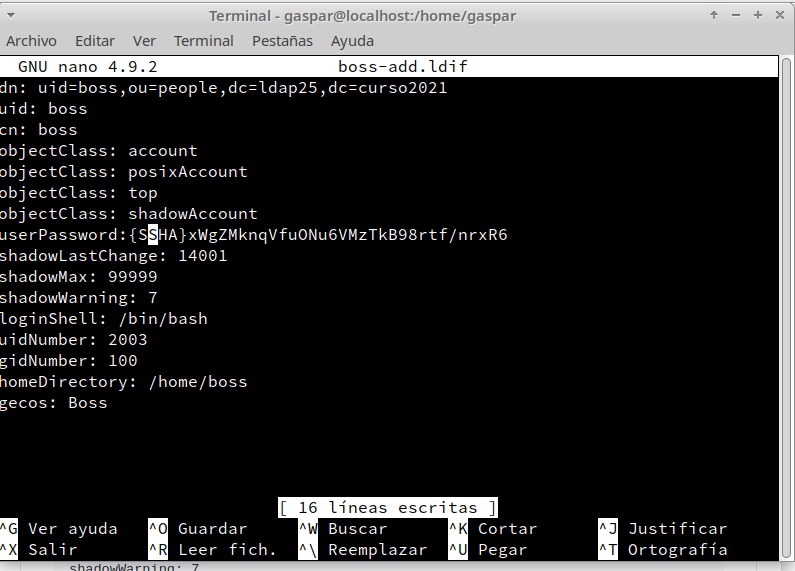
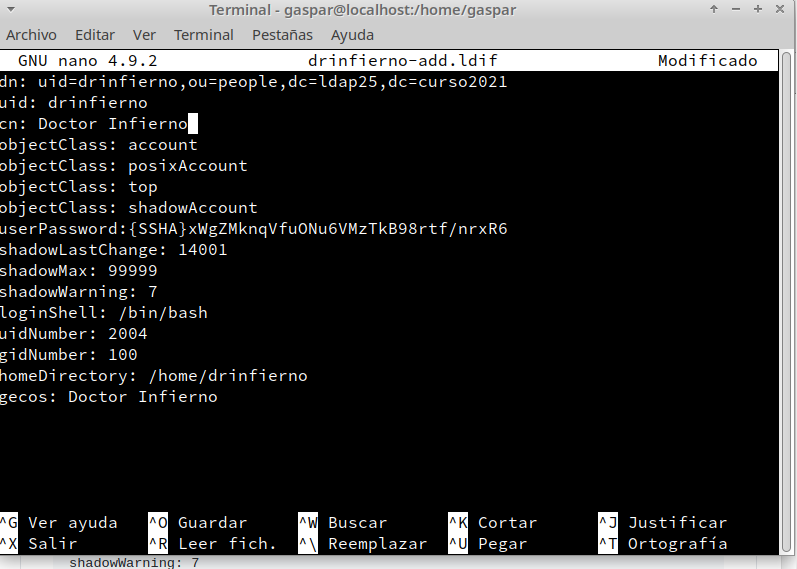

# Servicio de Directorio con Comandos
## 1. Nombre de equipo FQDN
* La máquina deberá tener un FQDN = `server25g.curso2021`.
---
## 2. Instalar el Servidor LDAP
### 2.1 Instalación del paquete
* Instalamos la herramienta con el comando `zypper in 389-ds`
* Comprobaremos la versión con `rpm -qa | grep 389-ds` (Nos tendremos que asegurar que, la version es>=1.4).

### 2.2 Configurar la instancia
* Crearemos el archivo `/root/instance.inif` y escribiremos la siguiente configuración:

`#/root/instance.inf
[general]
config_version = 2
[slapd]
root_password = YOUR_ADMIN_PASSWORD_HERE
[backend-userroot]
sample_entries = yes
suffix = dc=ldapXX,dc=curso2021`

* Luego ejecutamos el comando `dscreate -v from-file /root/instance.inf` para crear nuestra instancia desde el archivo `instance.inf` y con `dsctl localhost status` comprobaremos su estado.

* Luego crearemos el fichero de configuración `.dsrc`:

```
# cat ~/.dsrc
[localhost]
# Note that '/' is replaced to '%%2f'.
uri = ldapi://%%2fvar%%2frun%%2fslapd-localhost.socket
basedn = dc=ldapXX,dc=curso2021
binddn = cn=Directory Manager
```

### 2.3 Comprobar el Servicio
* Comprobamos que el servicio está en ejecución con `systemctl status dirsrv@localhost`.



* Una vez compobado que el servicio esta activo, comprobamos que los puertos 389 y 636 están abiertos con `namp -Pn server21g | grep -P '389|636'`.

### 2.4 Comprobar el acceso al contenido de LDAP
* Comprobar, con el comando `ldapsearch -b "dc=ldap21,dc=curso2021" -x | grep dn`, que existen las OU Groups y People.
* También podemos hacer la consulta usando el usuario/clave con `ldapsearch -H ldap://localhost -b "dc=ldap21,dc=curso2021" -W -D "cn=Directory Manager" | grep dn`.


---
## 3. Añadir usuarios LDAP por comandos
### 3.1 Buscar Unidades Organizativas
* LDAP nos permite filtrar. Un ejemplo es:

```
ldapsearch -H ldap://localhost:389
           -W -D "cn=Directory Manager"
           -b "dc=ldapXX,dc=curso2021" "(ou=*)" | grep dn
```

### 3.2 Agregar usuarios
* Ahora crearemos el archivo `mazinger-add.ldif` con la siguiente configuración de creación del usuario `mazinger`:`

```
dn: uid=mazinger,ou=people,dc=ldapXX,dc=curso2021
uid: mazinger
cn: Mazinger Z
objectClass: account
objectClass: posixAccount
objectClass: top
objectClass: shadowAccount
userPassword: {CLEARTEXT}escribir la clave secreta
shadowLastChange: 14001
shadowMax: 99999
shadowWarning: 7
loginShell: /bin/bash
uidNumber: 2001
gidNumber: 100
homeDirectory: /home/mazinger
gecos: Mazinger Z`
```

* Escribimos los datos del fichero en LDAP con `ldapadd -x -W -D "cn=Directory Manager" -f mazinger-add.ldif `

### 3.3 Comprobar el nuevo ususario
* Ejecutamos el comando `ldapsearch -W -D "cn=Directory Manager" -b "dc=ldapXX,dc=curso2021" "(uid=*)"` para comprobar que se ha creado el usuario correctamente.



---
## 4. Contraseñas encriptadas
### 4.2 Agregar usuarios con clave encriptadas
Usuario `Koji Kabuto`:
- Primero generamos la clave.



- Copiaremos la clave generada, lugo creamos el archivo `koji-add.ldif` con los datos necesarios y en el valor `userPassword` ingresamos la clave generada.

- Escribimos los datos del fichero en LDAP:



Repetiremos estos mismos pasos para los usuarios `Boss` y `Doctor Infierno`:




### 4.3 Comprobar los usuarios creados
* Ir a la MV cliente LDAP.

* `nmap -Pn IP-LDAP-SERVER`, comprobamos que el puerto LDAP del servidor está abierto.
Si no aparecen los puertos abiertos, entonces tendremos que confiurar el cortafuegos.

* `ldapsearch -H ldap://IP-LDAP-SERVER -W -D "cn=Directory Manager" -b "dc=ldapXX,dc=curso2021" "(uid=*)" | grep dn` para consultar los usuarios LDAP que tenemos en el servicio de directorio remoto.
