# Recursos compartidos SMB-CIFS
### 1.Preparativos y crear usuarios
- Creamos un servidor GNU/Linux y lo configuramos.
- Nombre del servidor `server25g`.
- En el fichero `/etc/host` añadir los equipos `cliente25g` y `cliente25w` con la ip asignada.
- Luego crearemos los grupos `piratas`, `soldados` y `sambausers`.
- En el grupo `piratas`, añadimos a `pirata1`, `pirata2` y `supersamba`.
- En el grupo `soldados`, añadimos a `soldado1`, `soldado2` y `supersamba`.
- En el grupo `sambausers`, añadimos a todos los usuarios `soldados`, `piratas`, `supersamba` y `sambaguest`.

### 1.4 Configurar servidor Samba
- Lo primero será abirir `Yast -> Samba Server`:
    - En Workgroup: `curso2021`.
    - Sin controlador de dominio.
    - En la pestaña `Inicio` modificamos lo siguiente:
    - Iniciar durante el arranque.
    - Configuración de cortafuegos -> puerto abierto en el cortafuegos.

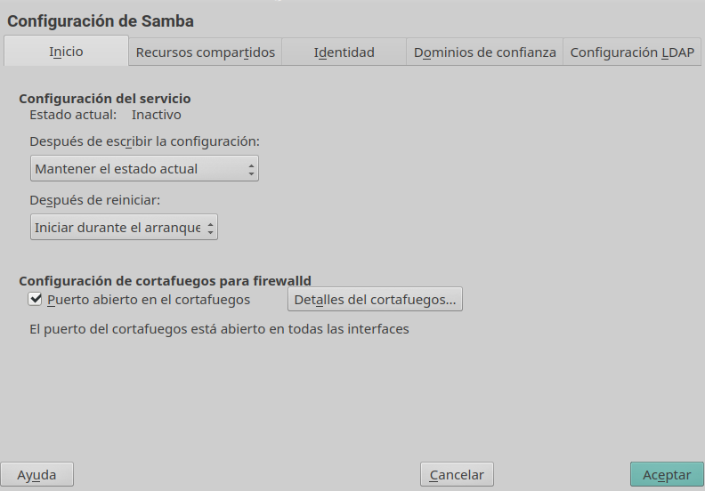

### 1.5 Crear los recursos compartidos de red
Ahora configuraremos los recursos compartidos de red en el servidor,para ello cambiamos el fichero de configuración que esta alojado en: `/etc/samba/smb.conf`.
- configuramos los apartados `global`, `public`, `barco` y `castillo`.
- Ejecutamos el comando `testparm` para verificar si  la configuración es correcta.

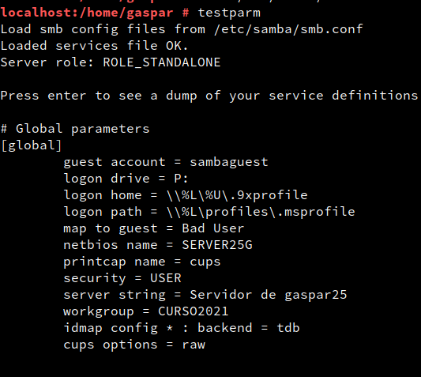

---
## 2 Windows
Vamos a configurar la máquina Windows. Para ello usaremos el nombre y la IP que hemos establecido en el fichero `/etc/hosts` del servidor.
Una vez configurada la máquina, editaremos el fichero `.../etc/hosts` y pondremos dentro el nombre y la IP de nuestro servidor.

### 2.1 Cliente Windows GUI
Desde un cliente Windows vamos a acceder a los recursos compartidos del servidor Samba.

* Escribimos `\\ip-del-servidor-samba` y vemos las carpetas que habiamos creado en el servidor samba

* Acceder al recurso compartido `public`, luego accedemos al recurso compartido `castillo` con el usuario `soldado`y por último accederemos al recurso compartido `barco` con el usuario `pirata`.
* Ir al servidor Samba.
* Capturar imagen de los siguientes comandos para comprobar los resultados:
    * `smbstatus`, desde el servidor Samba.
    * `lsof -i`, desde el servidor Samba.
  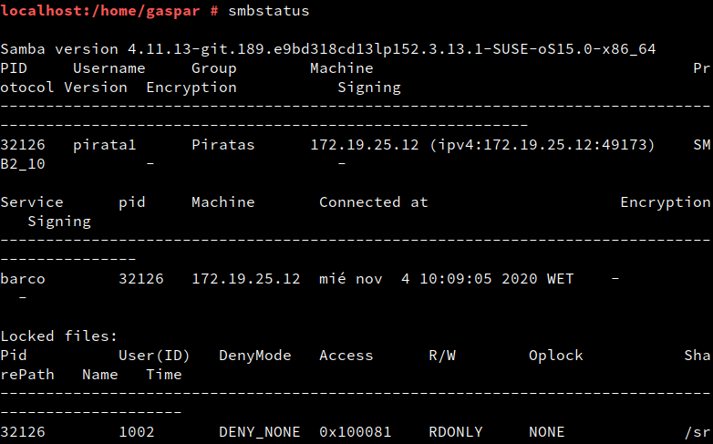
  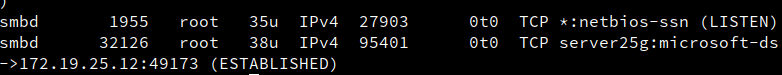  

### 2.2 Cliente Windows comandos
- Con el comando `net view \\172.19.21.31` vemos los recursos compartidos del servidor remoto.

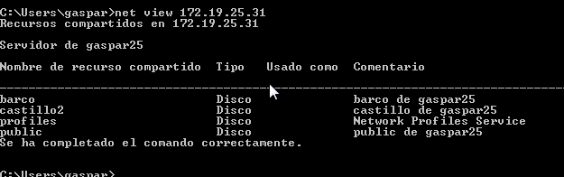

Vamos a montar el recurso `barco` de forma persistente.
- Ejecutar el siguiente comando:
- `net use S: \\IP-SERVIDOR-SAMBA\recurso contraseña /USER:usuario /p:yes`
- Ahora podemos entrar en la unidad S: y crear carpetas,
- Volver al servidor Samba y ejecutaremos los comandos anteriores:
- `smbstatus`
- `lsof -i`
---
## 3 Cliente GNU/Linux
### 3.1 Cliente GNU/Linux GUI
- Entrar al explorador de archivos de Linux, pulsar `CTRL + L` y escribir `smb://172.19.21.31` para ver todos los recursos compartidos.

- Intentar crea una carpeta en `barco`:

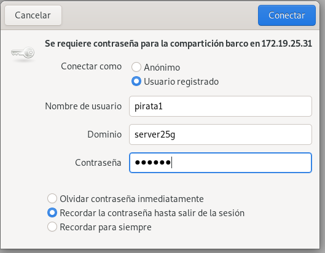
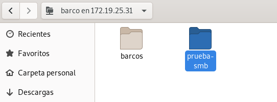
- repetiremos el paso anterior en `castillo`:
- Si intentamos crear una carpeta en `public` vemos que no tenemos permiso, pues es de sólo lectura.

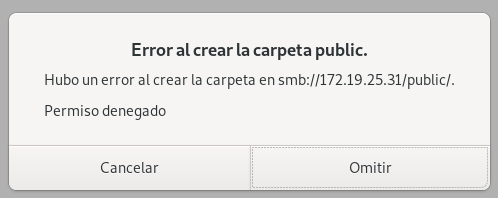

- Volver al servidor Samba
- Ejecutar `smbstatus`:

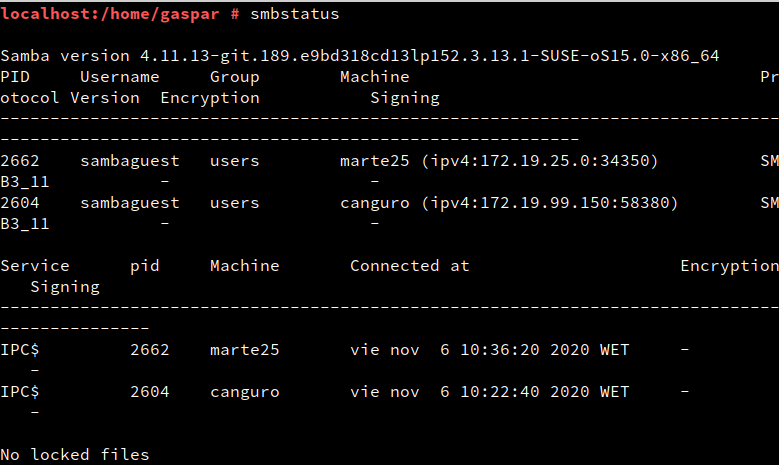

- Ejecutar `lsof -i`:

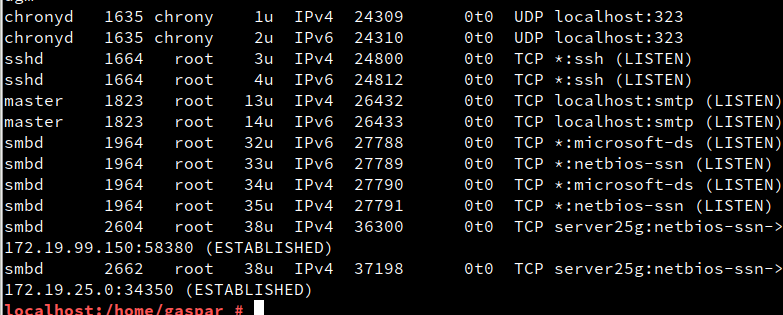

### 3.2 Cliente GNU/Linux comandos
- Con el comando `smbcliente --list 172.19.21.31` comprobamos los recursos compartidos del servidor remoto.

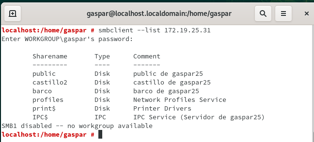

- Crear la carpeta local `/mnt/remoto21/castillo`.
- Montamos el recurso compartido en la carpeta que acabamos de crear con el comando `mount -t cifs //172.19.21.31/castillo /mnt/remoto21/castillo -o username=soldado1` y comprobamos que se ha montado correctamente con el comando `df -hT`.

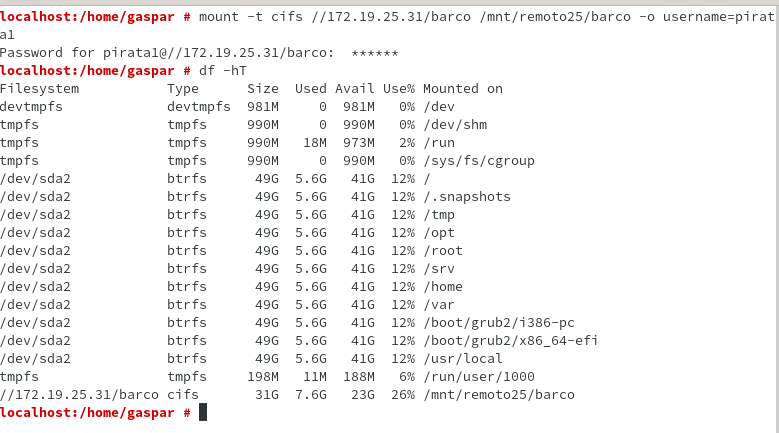

- Probamos a crear un archivo `soldado1.txt` desde el cliente.
- Al comprobarlo desde el servidor vemos que se ha creado correctamente y luego.
- Ejecutar `smbstatus`:

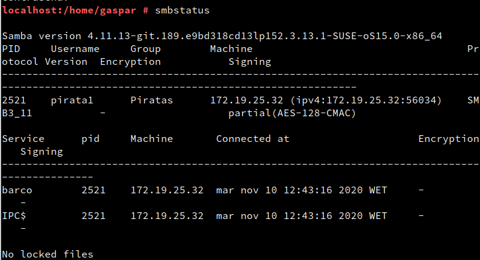
- Ejecutar `lsof -i`:

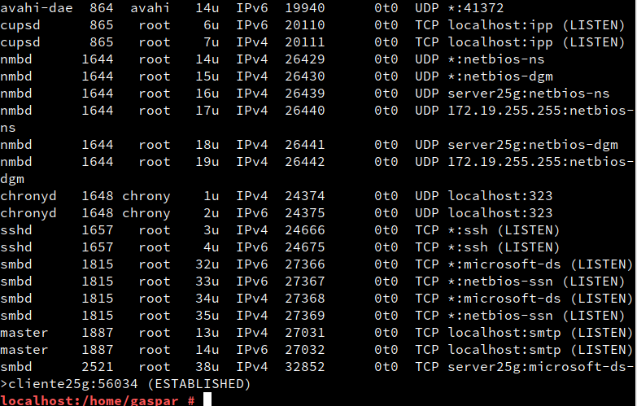

### 3.3 Montaje automático
- Reiniciamos la maquina y ejecutamos `df -hT` vemos que el recurso castillo ya no está.

- Para configurar acciones de montaje automáticos cada vez que se inicie el equipo, debemos configurar el fichero `/etc/fstab` añadiendo una línea `//172.19.21.31 castillo /mnt/remoto21/castillo cifs username=soldado1,password=soldado1 0 0`.

-Ahora reiniciaremos la máquina y ejecutamos el comando `df -hT` y ahora sí se queda guardada la configuración.

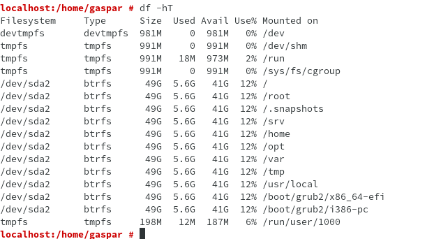
