## Tema 3
# Servidor de impresión en Windows
## 1. Impresora compartida
### 1.1 Rol impresión
* Vamos a necesitar un Windows Server y ademas un windows cliente.
* Nos vamos al server, instalamos en rol/función de servicios de impresión.

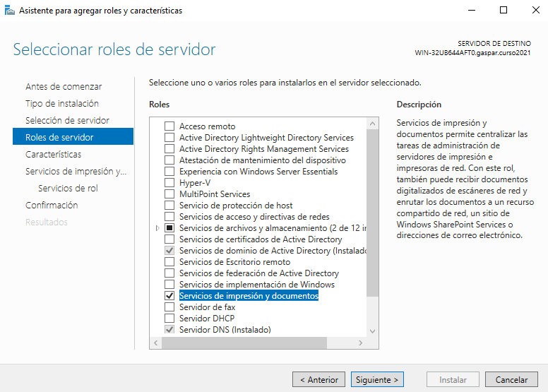

- Necesitaremos par esta practica la Impresión en Internet.

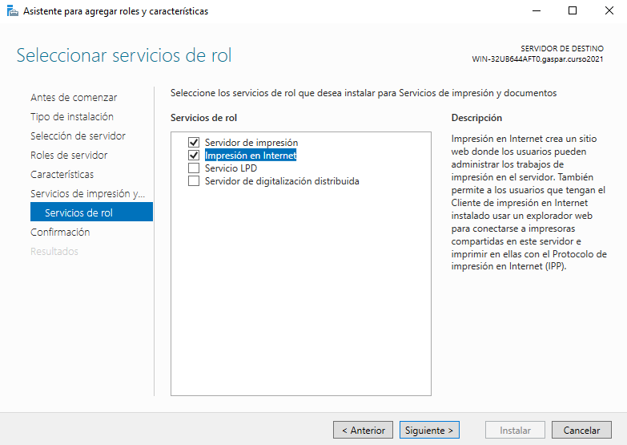

### 1.2 Instalar impresora PDF
* Ahora tendremos que descargar la herramienta `PDFCreator`.

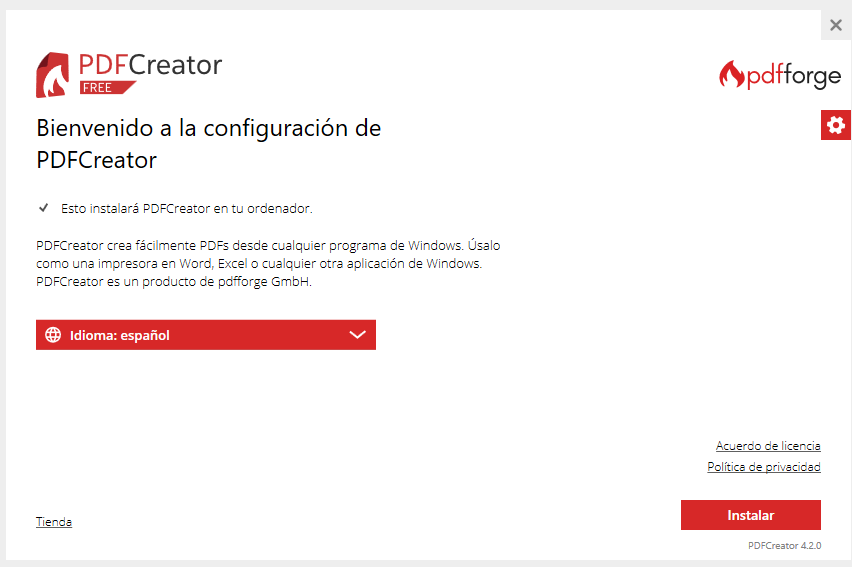

* Una vez instalado vamos a configurarlo y nos dirigiremos a `Perfiles -> Guardar`, cuando estemos en este apartado configuraremos el guardado automático y además indicaremos la carpeta de destino para cuando vayamos a imprimir.

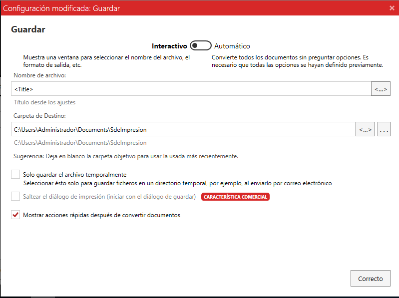

### 1.3 Probar impresión en local
* Ahora vamos a probar la impresión local, para ello creamos un archivo `imprimir25s-local`.

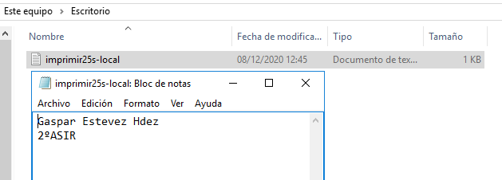

* Imprimimos el documento utilizando `PDFCreator`.

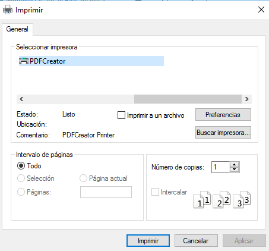

* Como podemos observar aparece el archivo, en la ruta que le habiamos indicado en la configuracion.

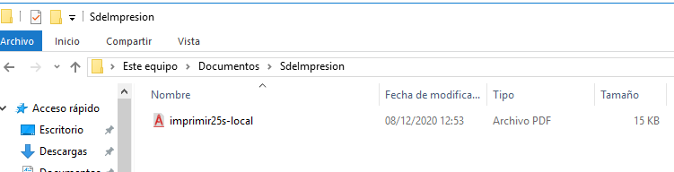

---
## 2. Compartir por red
### 2.1 En el servidor
* Para este paso lo primero será dirigirnos  `Herramientas -> Administrador de impresión -> Impresoras -> PDFCreator -> Compartir` y cambiar el nombre que aparece ahi por `PDFGaspar25`.

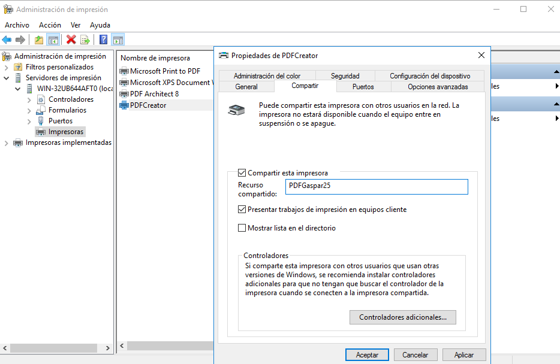

### 2.2 Comprobar desde el cliente
* Buscar recursos de red en el servidor con `\\192.168.1.100` y seleccionamos la impresora y nos conectamos.

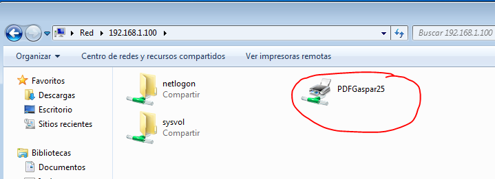

* Ahora tendremos que hacer lo mismo que hicimos en local, primero craemos un documento esta vez llamado `imprimir25w-remoto`.

* Imprimimos seleccionando `PDFCreator`.

* Ahora al volver a la carpeta de destino en el servidor vemos que aparece el documento que creamos en el cliete.

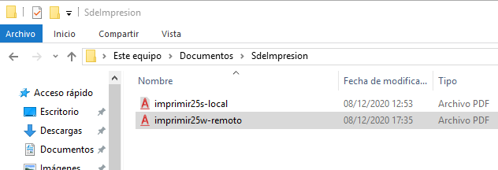

---
## 3. Acceso Web
### 3.1 Instalar característica Impresión WEB
* Vamos al servidor
- Comprobamos que está instalado el servicio `Impresión de Internet`, que como lo habiamos hecho previamente pues está instalado.

### 3.2 Configurar impresión WEB
* Vamos al cliente.

* Ahora vamos a abrir el navegador y ponemos la URL `http://192.168.1.100/printers`. Aparecerá lo que se muestra a continuación, entraremos con el usuario administrador.

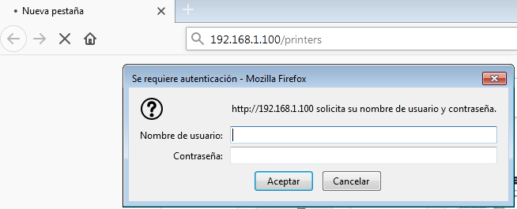

* Vamos a `Propiedades` y copiamos el nombre de la red.

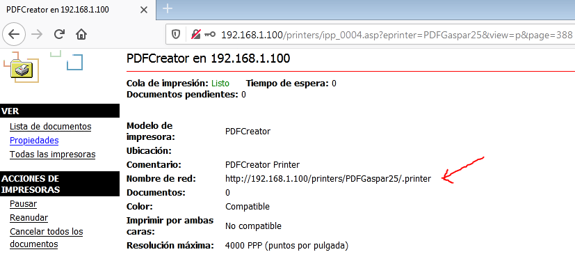

* Ahora una vez copiado el nombre de la red agregamos una nueva impresora de red, en la opción `seleccionar una impresora` pegamos el nombre de la red.

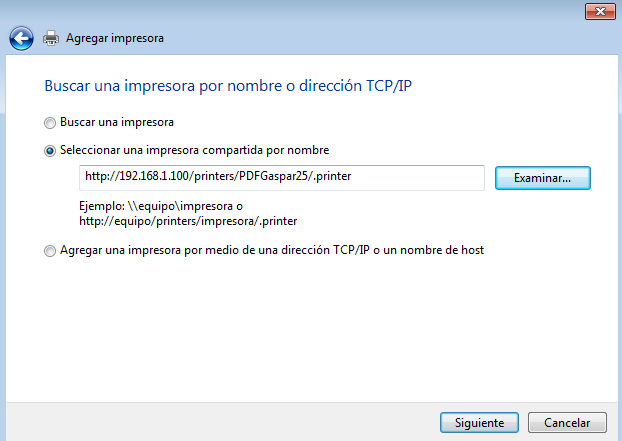

* Ponemos el usuario y la contraseña, usuario administrador.

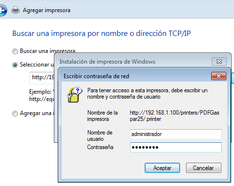

* Una vez hecho esto nos aparecerá un mensaje de que se agrego correctamente.

### 3.3 Comprobar desde el navegador
* Para probar si funciona lo primero será poner la impresora en pausa desde el servidor. Entonces una vez hecho esto crearemos un archivo `imprimir25w-Web`,imprimir y seleccionamos la impresora en `http://192.168.1.100`.

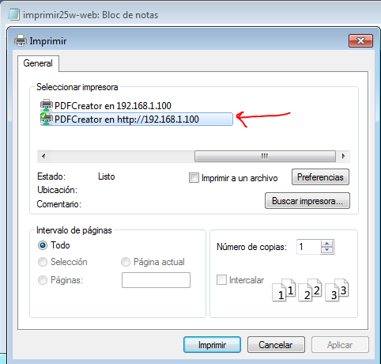

- Como la impresora estaba en pausa, no se a impreso el documento, asi que le daremos a reanudar.

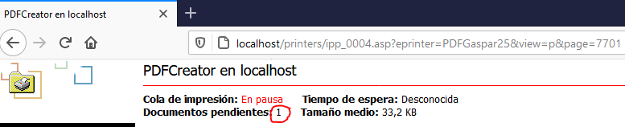

- Y como vemos una vez reanudado, el archivo nos aparece en la carpeta.

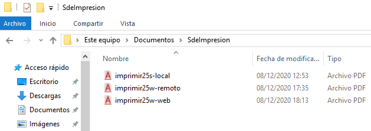
