## Tema 5
# Vagrant con VirtualBox
## 1. Instalar Vagrant

* Instalaremos Vagrant, para ello hay que tener en cuenta que las versiones de Vagrant y VirtualBox deben ser compatibles. En este caso si lo son.
---
## 2. Proyecto Celtics
### 2.1 Imagen, caja o box
* Necesitaremoos descargr una caja y para ello utilizamos el comando `vagrant box add BOXNAME` ( cambiando el nombre de la caja por `ubuntu/bionic64`).

* Comprobamos que se a descargado correctamente con `vagrant box list`.

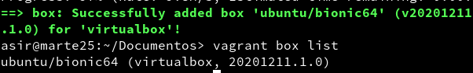
---
### 2.2 Directorio
* Para el primer proyecto necesitaremoos crear un directorio con el siguiente nombre `vagrant25-celtics`, una vez creado nos movemos a ese directorio.

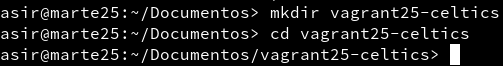

* Una vez en el, creamos un fichero llamado `Vagrantfile`:

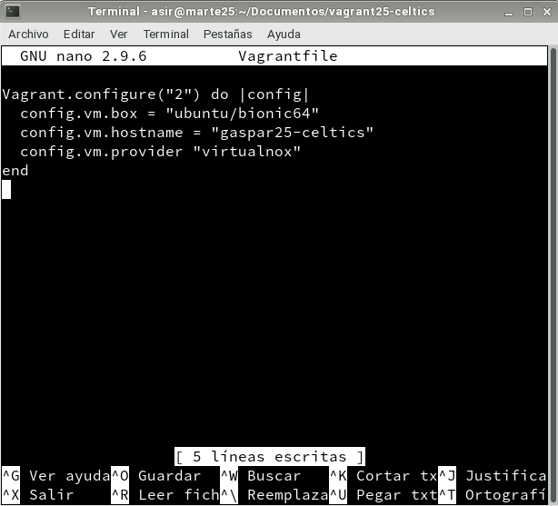

### 2.3 Comprobar
* Estando en ese directorio y con el fichero `Vagrantfile`, ejecutamos el comando `vagrant up`.

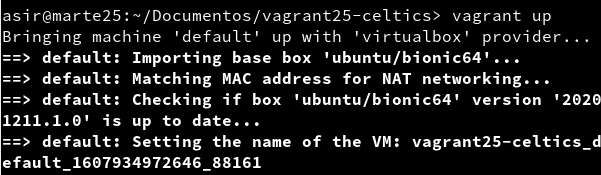

* Para comprobar que se ha iniciado correctamente entramos mediante SSH utilizando `vagrant ssh`.

---
## 3. Proyecto Hawks

### 3.1 Crear proyecto Hawks
* Creamos la carpeta `vagrant25-hawks`, y el archivo `Vagrantfile` de la siguiente manera:

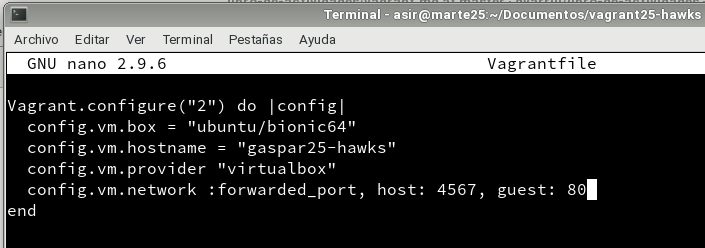

* Ejecutamos el comando `vagrant up` y entramos mediante ssh.

* Una vez dentro vamos a instalar el `apache2`.

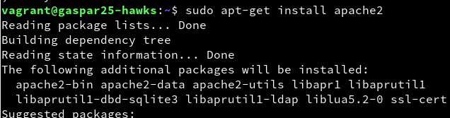

### 3.2 Comprobar
* Para comprobar, en la máquina real, vemos que el puerto 4567 está a la escucha con `vagrant port`.

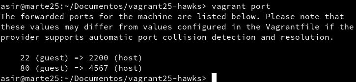

* Abrimos un navegador desde el host con el URL `127.0.0.1:4567` y vemos que nos lleva a la página por defecto de Apache2.

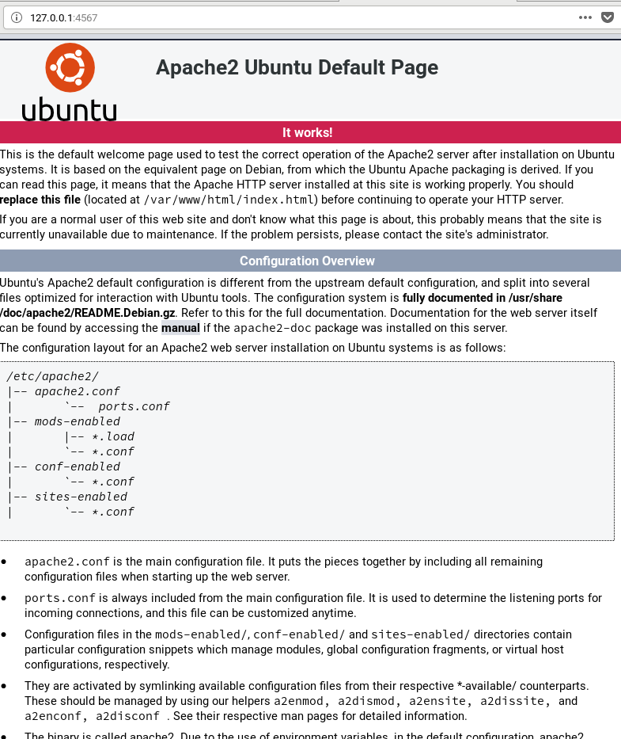

---
## 4. Suministro

### 4.1 Proyecto Lakers (Suministro mediante shell script)
* Vamos a crear el directorio `vagrant25-lakers` con una carpeta llamada `html` y,en ella, un fichero `index.html`.

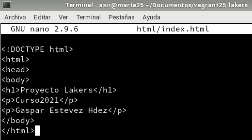

* Vamos a crear el scrpit `install_apache.sh` con lo siguiente:

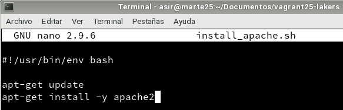

* Por ultimo, creamos el `Vagrantfile` añadiendo una linea que permitirá ejecutar el script anterior y luego, `vagrant up` para crear la máquina virtual..

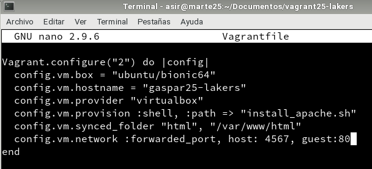

* Vamos a comprobar que apache ha sido instalado y está utilizando nuestro `index.html`, vamos a abrir un navegador en la máquina real con el URL `127.0.0.1:4567`.

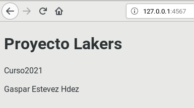

### 4.2 Proyecto Raptors (Suministro mediante Puppet)
* Creamos el directorio `vagrant25-raptors` con el siguiente `Vagrantfile`.

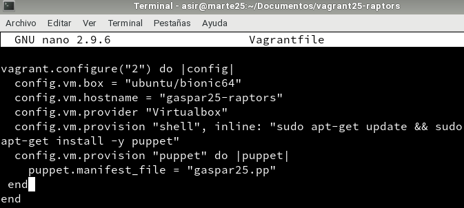

* Ahora dentro de directorio vamos a crear una carpeta `manifests` y dentro un archivo llamado `gaspar25.pp` con lo siguiente:

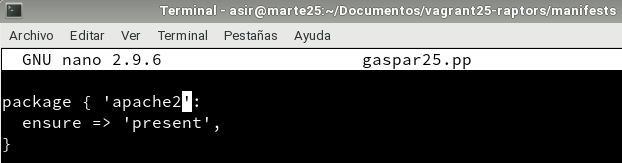

* Creamos la máquina con `vagrant-up`.

* Para que se apliquen los cambios de configuración tenemos 2 caminos:
* **Con la MV encendida**
    1. `vagrant reload`, recargar la configuración.
    2. `vagrant provision`, volver a ejecutar la provisión.
* **Con la MV apagada**:
    1. `vagrant destroy`, destruir la MV.
    2. `vagrant up` volver a crearla.

* En mi caso elegí `vagrant provision`:

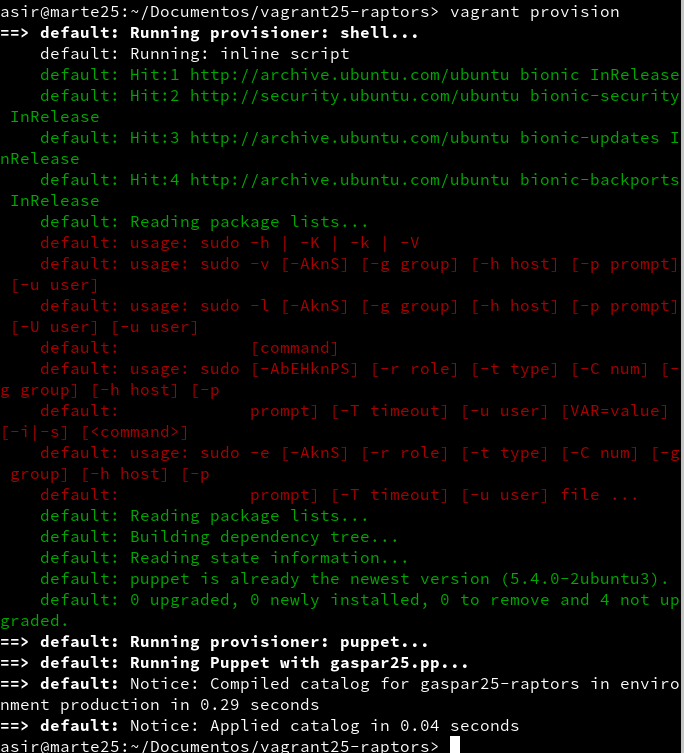
---
## 5. Proyecto Bulls (Nuestra caja)
### 5.1 Preparar la MV VirtualBox
**Elegir la máquina virtual**
* Crear una MV VirtualBox nueva o usar una que ya tengamos(en mi caso una ya creada).
* Configurar la red en modo dinámico (DHCP).
* Instalaremos OpenSSH,(en mi caso ya estaba instalado).

**Crear usuario con acceso SSH**

* Crear el usuario vagrant.

* Poner clave "vagrant" al usuario vagrant.

* Poner clave "vagrant" al usuario root.
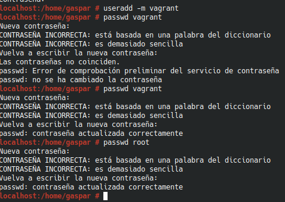

* Configuramos acceso por clave pública al usuario `vagrant`:
    * `mkdir -pm 700 /home/vagrant/.ssh`, creamos la carpeta de configuración SSH.
    * `wget --no-check-certificate 'https://raw.github.com/mitchellh/vagrant/master/keys/vagrant.pub' -O /home/vagrant/.ssh/authorized_keys`, descargamos la clave pública.
    * `chmod 0600 /home/vagrant/.ssh/authorized_keys`, modificamos los permisos de la carpeta.
    * `chown -R vagrant /home/vagrant/.ssh`, modificamos el propietario de la carpeta.

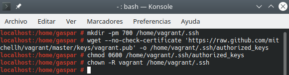

**Sudoers**

* Añadir `vagrant ALL=(ALL) NOPASSWD: ALL` al fichero de configuración `/etc/sudoers`.

**Añadir las VirtualBox Guest Additions**

* En mi caso no tenia instaladas las `VirutalBox Guest Additions` asi que las instalo. Y una vez instalado, reiniciamos.

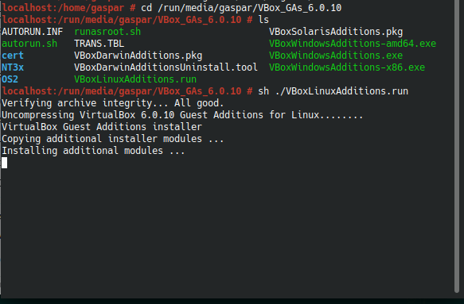

* Debemos asegurarnos que tenemos instalado las VirtualBox Guest Additions con una versión compatible con el host anfitrión. Comprobamos:

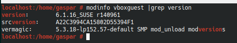

### 7.2 Crear caja Vagrant

* Vamos a crear una nueva carpeta `vagrant25-bulls` para el nuevo proyecto.

* Con `VBoxManage list vms` vemos todas nuestras máquinas creadas. En este caso vamos a elegir la llamada `Opensuse Vagrant`.

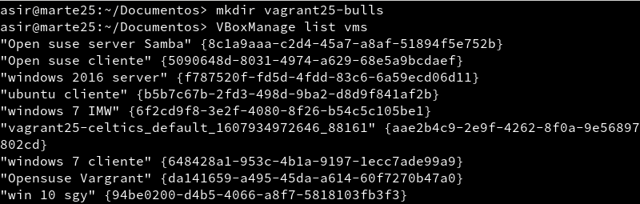

* Con la máquina apagada, ejecutamos `vagrant package --base VMNAME --output nombre-alumnoXX.box` para crear nuestra caja. Y comprobamos que se haya creado el archivo `gaspar25.box`

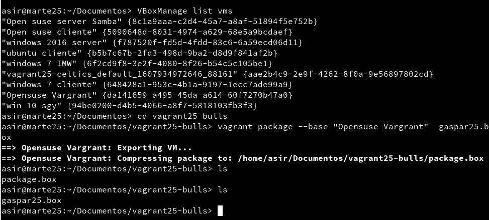

* `vagrant box add nombre-alumno/bulls nombre-alumnoXX.box`, añadimos la nueva caja creada por nosotros, al repositorio local de cajas vagrant de nuestra máquina.

* `vagrant box list`, consultar ahora la lista de cajas Vagrant disponibles y vemos que si aparece nuestra caja.

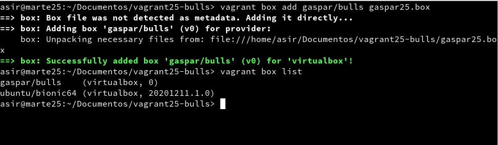
