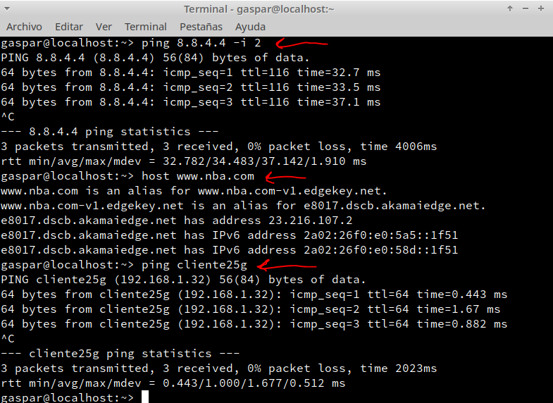

# Tema 1
## Acceso remoto con SSH

## 1.- Preparativos

### 1.1.- Servidor SSH

###(Antes que nada decir que esta practica se hacia con un server sin entorn gráfico, pero al yo tener uno ya instalado y configurado con entorno gráfico, lo aproveche para hacer la práctica).

* Para esta práctica necesitaremos un MV que hará de servidor SSH el cual configureremos como otras maquinas.

* Tendremos que añadir en `/etc/hosts` los equipos cliente25g y cliente25w con su IP.

* Comprobamos con los siguientes comandos:

  * `ip a` este comando muestra la IP y la máscara.
  * `ip route` se muetraa la puerta de enlace.

  * `ping 8.8.4.4 -i 2` conectividad externa.
  * `host www.nba.com` el servidor DNS
  * `ping cliente25g` se muestra si hay conectividad con el cliente

  * `ping cliente25w` se muestra si hay conectividad con el cliente Windows en este caso.

- Crear los siguientes usuarios:

### 1.2.- Cliente GNU/Linux

* Crear una MV OpenSUSE con la configuración estándar y nombre de máquina `cliente25g`.

* Añadir en `/etc/hosts` los equipos server21g y cliente21w con sus IPs.

* Hacemos un ping al server para comprobarla conectividad.

### 1.3.- Cliente Windows
* Crear una MV Windows con la configuración estándar y nombre de máquina `cliente25w`.

* Instalar PuTTY (cliente de SSH).

* En `C:\Windows\System32\drivers\etc\hosts` añadimos a server25g y cliente25g con sus IPs.

* Hacemos un ping al server para comprobarla conectividad.

---

## 2.- Instalación del servicio SSH en GNU/Linux

* Instalar el servicio SSH en la máquina server25g para ello utilizaremos el comando `zypper install openssh`.

### 2.1.- Comprobación

* Ejecutamos el comando `systemctl status sshd` para saber si se a instalado correctamente y esta en funcionamiento.

* Ahora tendremos que comprobar el puerto 22 esta en escucha para ello utilizar `sudo lsof -i:22`.

### 2.2.- Primera conexión SSH desde Linux.

* En el cliente, lo primero que tenemos que comporbar es si tenemos conectividad con el servidor con `ping server25g`.

* Asegurarnos de que el puerto 22 está abierto con `nmap -Pn server25g`.

* Nos conectamos con `ssh estevez1@server25g`.

* Una vez hecho esto, al conectarnos de nuevo ya nos pedirá la contraseña unicamente

### 2.3.- Primera conexión SSH desde Windows.

* Nos conectamos al servidor usando PuTTY y poniendo la ip de `server25g`.

* Como vemos en la primera conexion se produce un intercambio de claves.

* Y como vemos nos conectamos correctamente.

---

## 3.- Cambiamos la identidad del servidor.

* Para este paso tendremos que modificar el fichero `/etc/ssh/sshd_config` en el cual dejamos una única línea sin comentar: `HostKey /etc/ssh/ssh_host_rsa_key`.

### 3.1.- Regenerar certificado

* Vamos al servidor.

* En el servidor Ejecutamos `ssh-keygen -t rsa -f /etc/ssh/ssh_host_rsa_key` como root.

* Una vez regenerado el certificado reiniciamos el servicio `systemctl restart sshd`.

### 3.2.- Comprobar.
* Vamos a intentar conectarnos al servidor, como regeneramos el certificado del servidor, ssh alerta de un posible ataque `man-in-the-middle` y es por esto que no nos deja conectarnos.

* Para solucionar esto copiaremos la clave que aparecia marcada y la pegaremos en `/home/gaspar/.ssh/known_hosts`

* Y como vemos noc conectamos correctamente

---

## 4.- Personalizar el prompt de Bash.
* Para personalizar el prompt cambiaremos el ficehro `/home/estevez1/.bashrc` en este caso cambiaremos el del usuario estevez1 y añadiremos lo siguiente

* Luego, crearemos el fichero `/home/estevez1/.alias` y por ejemplo añadiremos lo siguiente:

 Haciendo esto no tendremos que escribir los comandos enteros.
  - Linux:

  - Windows:

---

## 5.- Autenticación mediante claves públicas.

- Noa movemos a cliente25g.
- Ejecutar `ssh-keygen -t rsa` para generar un nuevo par de claves.

- Copiar la clave pública al `id_rsa.pub` al fichero `authorized_keys` en el usuario remoto estevez4:

- Comprobar que al acceder via SSH, desde cliente25g, no pide contraseña y desde cliente25w, sí pide contraseña.

---

## 6.- Uso de SSH como túnel X.

* Vamos a instalar una app de entorno gráfico en el servidor. En este caso, geany.

* Vamos a cambiar la opción `X11Forwarding yes` en el fichero `/etc/ssh/sshd_config`.

- Ahora nos conectamos al servidor por ssh pero esta vez con el parámetro -X: `ssh -X estevez1@server25g`, y ejecutar el programa.

---

## 7.- Aplicaciones Windows nativas.

* Para este paso vamos a utilizar el emulador WINE, vamos a ejecutar aplicaciones nativas de Windows mediante ssh.
* Instalar emulador Wine en server25g.
* Instalar el programa nativo de Windows mediante Wine, en este caso será notepad++.

* Comprobar el funcionamiento de notepad++ en cliente25g.

---

## 8.- Restricciones de uso
### 8.1.- Restricción subre un usuario.

* Vamos a modificar el fichero `/etc/ssh/sshd_config`, añadiendo la opción `DenyUser estevez2`.

* Comprobar si la sintaxis del fichero es correcta (0 => OK, 1 => ERROR)

* Por ultimo comprobaremos la restricción del usuario.

