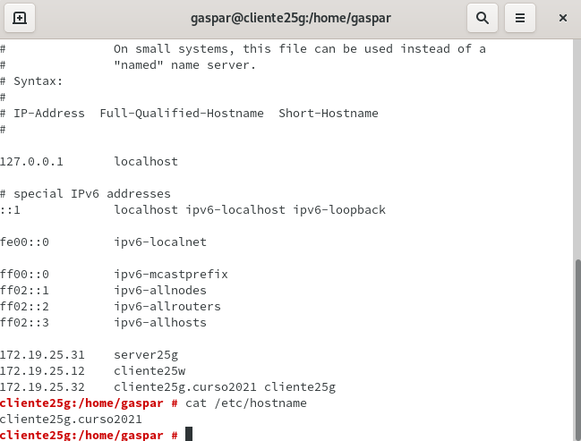
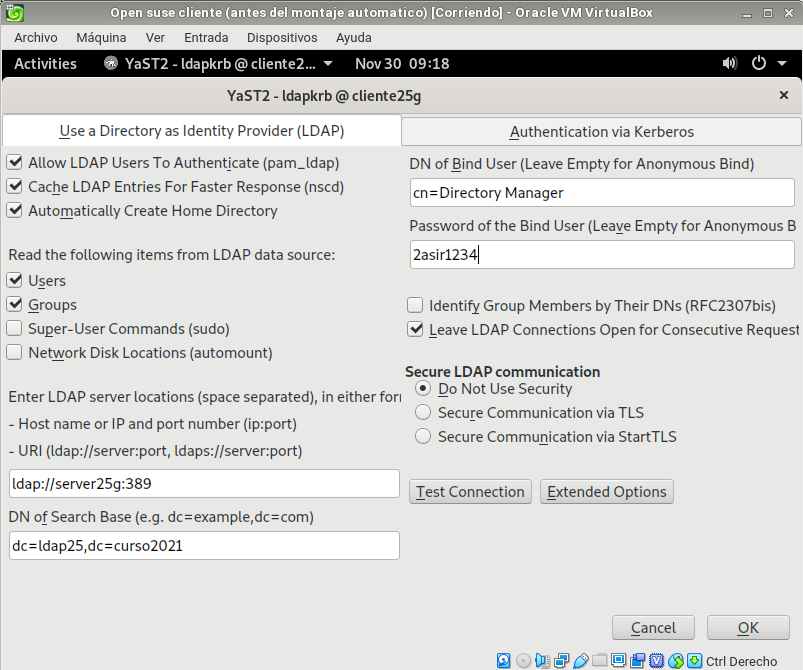
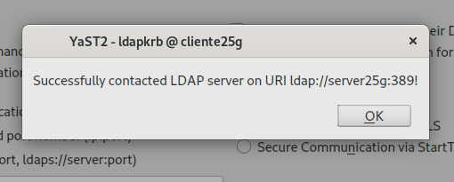
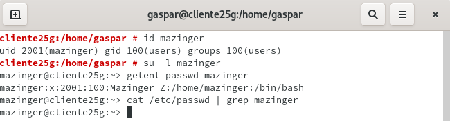

## Tema 4 - P2:Autenticación con 389-DS
# Cliente para autenticación LDAP
## 1. Preparativos
Para empezar la practica lo primero sera comprobar si podemos acceder correctament al servidor LDAP desde el cliente:
* Lo primero será saber si los puertos de LDAP están abiertos y para ello utilizaremos el siguiennte comando `nmap -Pn server21g | grep -P '389|636'` y luego con `ldapsearch -H ldap://server21g:389 -W -D "cn=Directory Manager" -b "dc=ldap21,dc=curso2021" "(uid=*)" | grep dn` comprobaremos que los usuarios de LDAP se muestran en el cliente.

---
## 2. Crear autenticación LDAP
### 2.1 Crear conexión con el Servidor
* Nos tendremos que asegurae de tener bien el nombre del equipo y nombre de dominio `(/etc/hostname, /etc/hosts)`

* Vamos a `Yast -> Cliente LDAP y Kerberos`.
* Configurar como la imagen siguiente:
    * BaseDN: `dc=ldapXX,dc=curso2021`
    * DN de usuario: `cn=Directory Manager`
    * Contraseña: CLAVE del usuario `cn=Directory Manager`

* Probamos a conectarnos y como vemos se conecta correctamente

### 2.2 Comprobar con Comandos

* Vamos a la consola con usuario root, y probamos lo siguiente

---

## 3. Crear usuarios y grupos dentro de LDAP
* A partir de aqui hicimos un proceso de investigacion y concluimos que lo mejor era dejarlo en este punto ya que daba errores a la hora de crear los usuarios
