# Tema 5

# Docker

## 1. Contenedores con Docker
### 1.1 Instalacion

  (Antes de empezar el informe decir que hasta cierto punto lo empeze a hacer con el pc de clase, pero luego decidi hacerlo en MV
  simplemente por la facilidad de trabajar en casa)

  Ejecutar como superusuario:
  * `zypper in docker`, instalar docker en OpenSUSE (`apt install docker` en Debian/Ubuntu).
  * `systemctl start docker`, iniciar el servicio. NOTA: El comando `docker daemon` hace el mismo efecto.
  * `systemctl enable docker`, si queremos que el servicio de inicie automáticamente al encender la máquina.
  * Comprobamos con `docker version`

  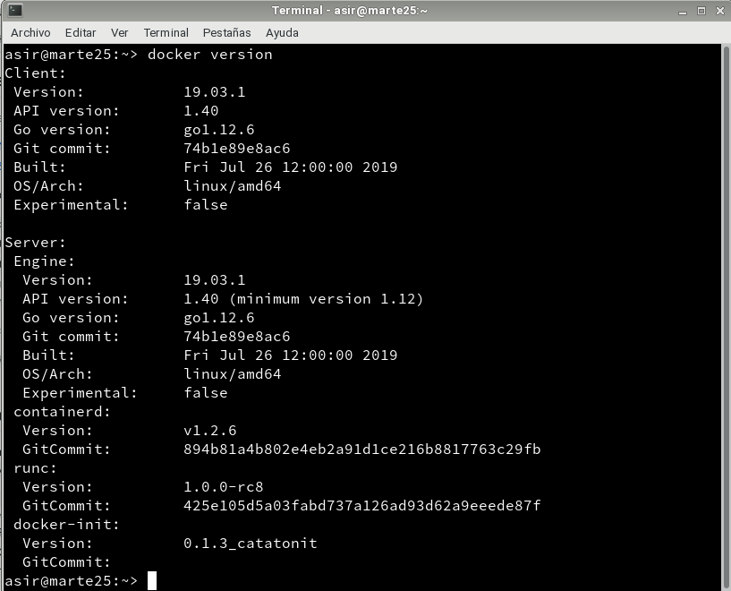

  * `cat /proc/sys/net/ipv4/ip_forward`, consultar el estado de IP_FORWARD. Debe estar activo=1.

  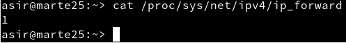

### 1.2 Primera prueba
* A partir de aqui, haremos todo sin usar sudo!!!!.
* `docker run hello-world`, este comando hace lo siguiente:
    * Descarga una imagen "hello-world"
    * Crea un contenedor y
    * ejecuta la aplicación que hay dentro.

  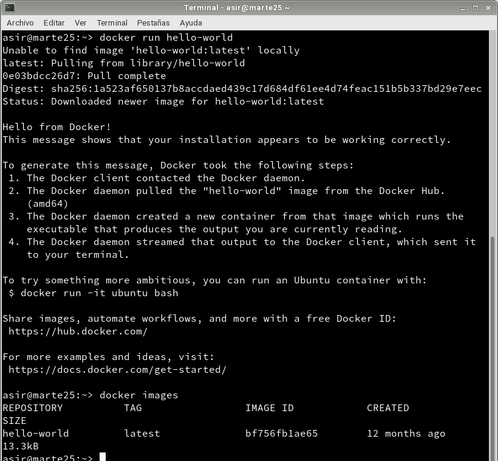

  * `docker images`, vemos la nueva imagen "hello-world" que habiamoss descargado en nuestro equipo.
  * `docker ps -a`, vemos que hay un contenedor en estado 'Exited'.
  * `docker stop IDContainer`, parar el conteneder.
  * `docker rm IDContainer`, eliminar el contenedor.

  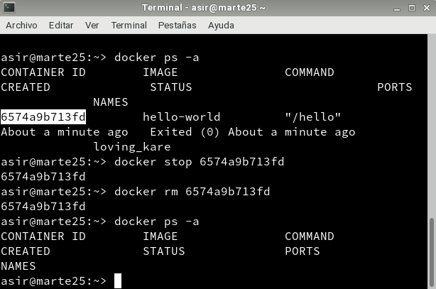

## 2. Creación manual de nuestra imagen
### 2.1 Crear un contenedor manualmente

Nuestro SO base es OpenSUSE, pero vamos a crear un contenedor Debian,
y dentro instalaremos Nginx.

**Descargar una imagen**
  * `docker search debian`, buscamos en los repositorios de Docker Hub contenedores con la etiqueta `debian`.
  * `docker pull debian`, descargamos una imagen en local.
  * `docker images`, comprobamos.

  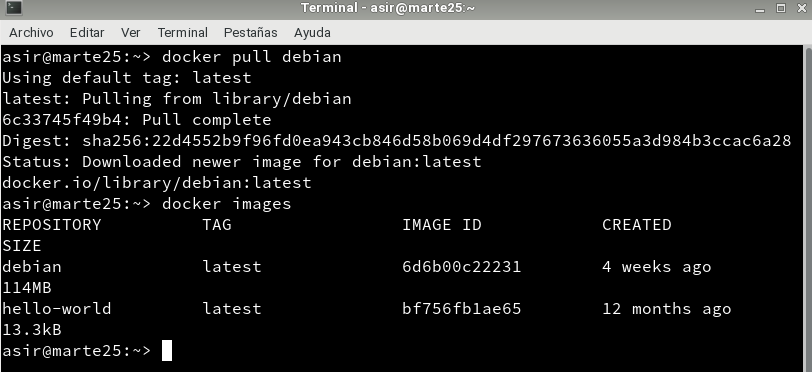

**Crear un contenedor**
  Crearemos un contenedor llamado `app1debian` a partir de la imagen `debian`, y ejecutaremos el programa `/bin/bash` dentro del contendor:
  * `docker run --name=app1debian -i -t debian /bin/bash`
  * Como vemos una vez hecho esto ya estaremos denro del contenedor.

  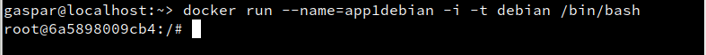

### 2.2 Personalizar el contenedor

  * Como ya estamos en el contenedor haremos lo siguiente:

**Instalar aplicaciones dentro del contenedor**

  ```
  root@IDContenedor:/# cat /etc/motd            # Comprobamos que estamos en Debian
  root@IDContenedor:/# apt-get update
  root@IDContenedor:/# apt-get install -y nginx # Instalamos nginx en el contenedor
  root@IDContenedor:/# apt-get install -y vim   # Instalamos editor vi en el contenedor
  ```
  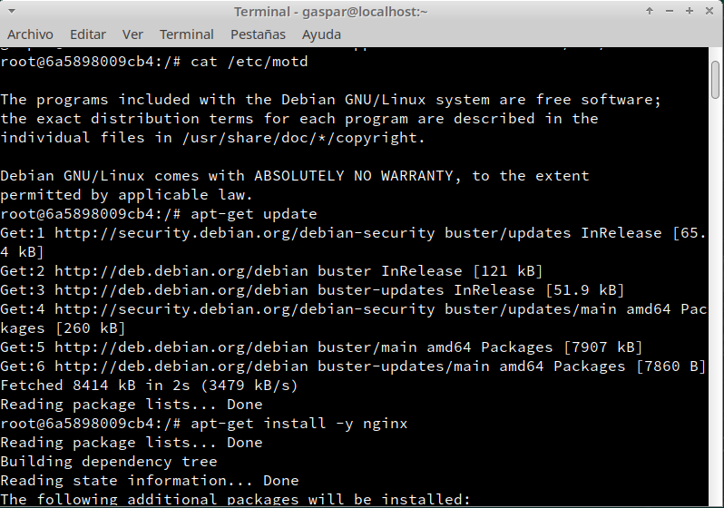

  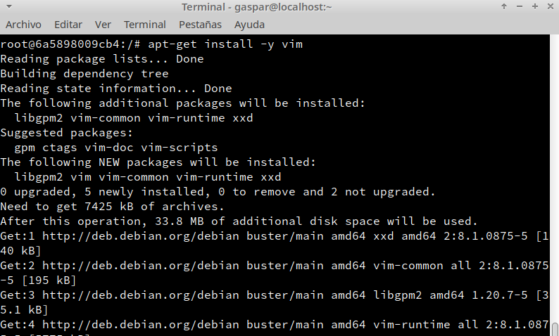

**Crear un fichero HTML** `holamundo1.html`.

  ```
  root@IDContenedor:/# echo "<p>Hola Gaspar</p>" > /var/www/html/holamundo1.html
  ```
  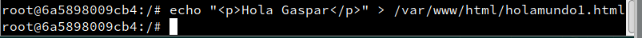

**Crear un script** `/root/server.sh` con el siguiente contenido:

  ```
  #!/bin/bash
  echo "Booting Nginx!"
  /usr/sbin/nginx &
  echo "Waiting..."
  while(true) do
    sleep 60
  done
  ```
  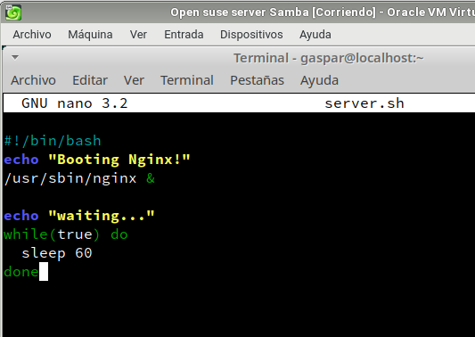

**Recordatorio:**
  * Hay que poner permisos de ejecución al script para que se pueda ejecutar (`chmod +x /root/server.sh`).

  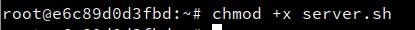

  * La primera línea de un script, siempre debe comenzar por `#!/`, sin espacios.
  * Este script inicia el programa/servicio y entra en un bucle, para mantener el contenedor activo y que no se cierre al terminar la aplicación.

### 2.3 Crear una imagen a partir del contenedor

  Una vez hecho todo lo anterior ya tendremos nuestro contenedor auto-suficiente de Nginx, ahora crearemos una nueva imagen que incluya los cambios que hemos hecho.

  * Abrir otra ventana de terminal.

  * `docker commit app1debian gaspar/nginx1`, a partir del CONTAINERID vamos a crear la nueva imagen que se llamará "nombre-del-alumno/nginx1".
  * `docker images`, comprobamos que se ha creado la nueva imagen.
  * Ahora podemos parar el contenedor, `docker stop app1debian` y
  * Eliminar el contenedor, `docker rm app1debian`.

  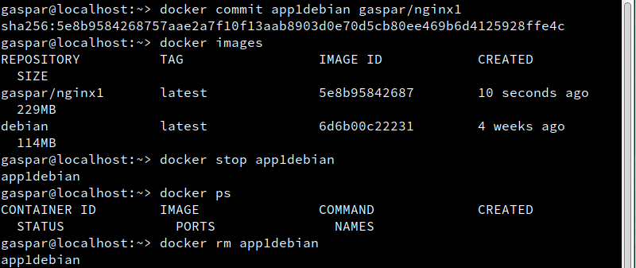  

## 3. Crear contenedor a partir de nuestra imagen
### 3.1 Crear contenedor con Nginx

  Ya tenemos una imagen "gaspar/nginx" con Nginx instalado.
  * `docker run --name=app2nginx1 -p 80 -t gaspar/nginx1 /root/server.sh`, iniciar el contenedor a partir de la imagen anterior.

  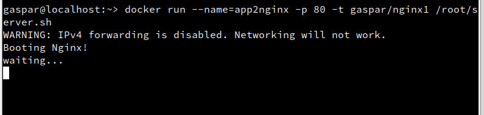

### 3.2 Comprobamos

  * Abrimos una nueva terminal.
  * `docker ps`, nos muestra los contenedores en ejecución. Podemos apreciar que la última columna nos indica que el puerto 80 del contenedor está redireccionado a un puerto local `0.0.0.0.:32768 -> 80/tcp`.

  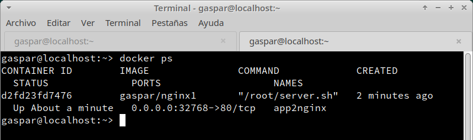

  * Abrir navegador web y poner URL `0.0.0.0.:32768`. De esta forma nos conectaremos con el servidor Nginx que se está ejecutando dentro del contenedor.

  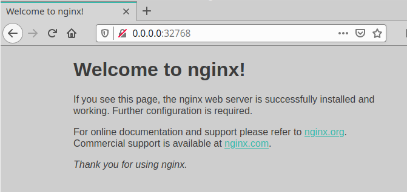

  * Comprobar el acceso a `holamundo1.html`.

  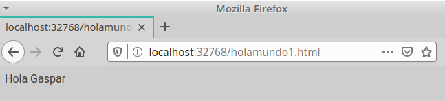

  * Paramos el contenedor `app2nginx1` y lo eliminamos.

  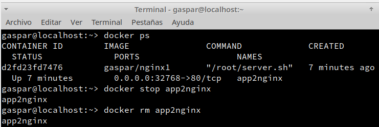

### 3.3 Migrar la imagen a otra máquina

**Exportar** imagen Docker a fichero tar:
  * `docker save -o gaspar25docker.tar nombre-alumno/nginx1`, guardamos la imagen
"gaspar/nginx1" en un fichero tar.

  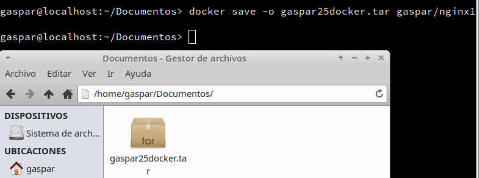

  Intercambiar nuestra imagen exportada con la de un compañero de clase(En mi caso yo lo hice con mi compañero Ayoze).

**Importar** imagen Docker desde fichero:

  * Nos llevamos el tar a otra máquina con docker instalado, y restauramos.
  * `docker load -i /home/gaspar/Descargas/ayoze07docker.tar`, cargamos la imagen docker a partir del fichero tar. Cuando se importa una imagen se muestra en pantalla las capas que tiene. Las capas las veremos en un momento.
  * `docker images`, comprobamos que la nueva imagen está disponible.

  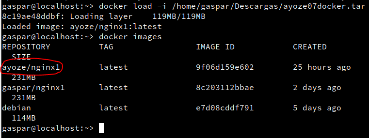

  * Probar a crear un contenedor (`app3gaspar`), a partir de la nueva imagen.

    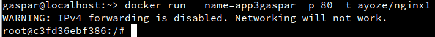

## 4. Dockerfile

Ahora vamos a usar un fichero de configuración para crear un contenedor a partir de un fichero `Dockerfile`.

### 4.1 Preparar ficheros

  * Crear directorio `/home/gaspar/docker25a`.
  * Entrar el directorio anterior.
  * Crear fichero `holamundo2.html` con:
      * Proyecto: docker25a
      * Autor: Gaspar
      * Fecha: Fecha actual

      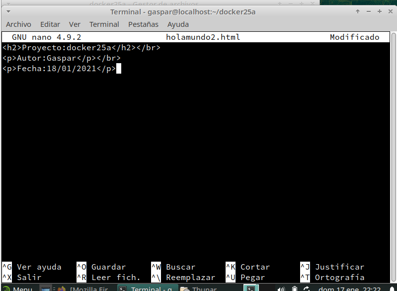

  * Crear el fichero `Dockerfile` con el siguiente contenido:

    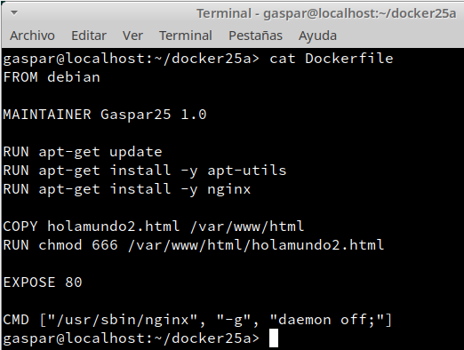

### 4.2 Crear imagen a partir del `Dockerfile`

  El fichero Dockerfile contiene toda la información necesaria para construir el contenedor, veamos:

  * `cd docker25a`, entramos al directorio con el Dockerfile.
  * `docker build -t gaspar/nginx2 .`, construye una nueva imagen a partir del Dockerfile. MUCHO CUIDADO con el punto final es necesario para que el comando funcione correctamente.

  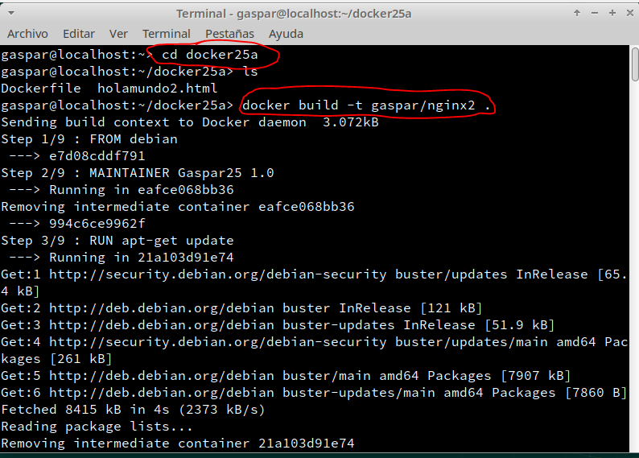

  * `docker images`, ahora debe aparecer nuestra nueva imagen.

  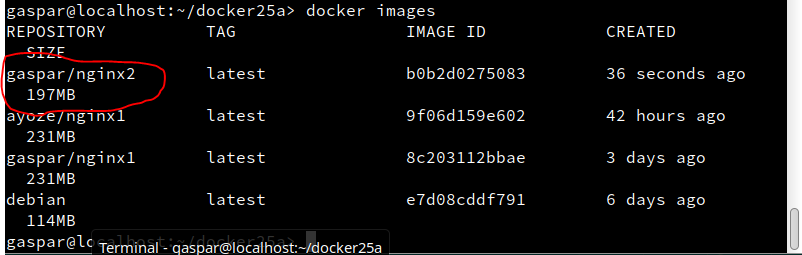

### 4.3 Crear contenedor y comprobar

  Vamos a crear un contenedor con el nombre `app4nginx2`, a partir de la imagen `gaspar/nginx2`. Probaremos con:

  ```
  docker run --name=app4nginx2 -p 8082:80 -t gaspar/nginx2
  ```
  Abrimos un terminal nuevo:
  * `docker ps`, para comprobar que el contenedor está en ejecución y en escucha por el puerto deseado.

  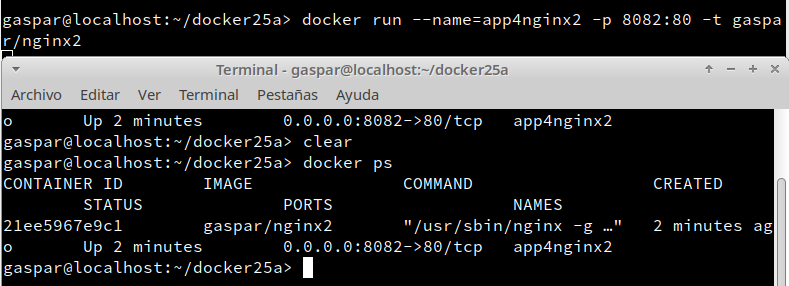

  * Comprobar en el navegador:
      * URL `http://localhost:8082`
      * URL `http://localhost:8082/holamundo2.html`
      * Como vemos funciona correctamente:

  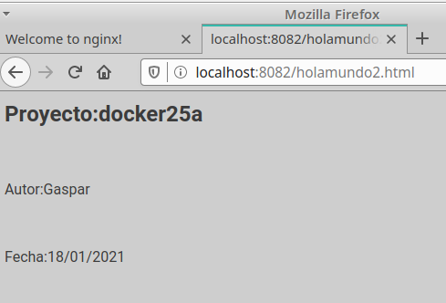

### 4.4 Usar imágenes ya creadas

  * Crea el directorio `docker25b`. Entrar al directorio.
  * Crear fichero `holamundo3.html` con:
      * Proyecto: docker25b
      * Autor: gaspar
      * Fecha: Fecha actual

  * Crea el siguiente `Dockerfile`

  ```
  FROM nginx
  COPY holamundo3.html /usr/share/nginx/html
  RUN chmod 666 /usr/share/nginx/html/holamundo3.html
  ```

  * Poner el el directorio `docker25b` los ficheros que se requieran para construir el contenedor.

  

  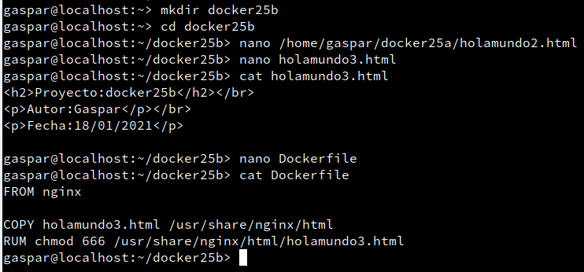

  * `docker build -t gaspar/nginx3 .`, crear la imagen.

  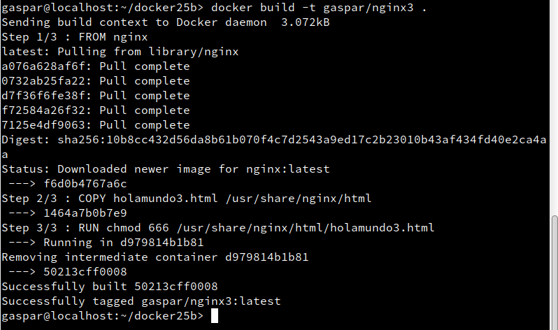

  * `docker run --name=app5nginx3 -d -p 8083:80 gaspar/nginx3`, crear contenedor.
  * Comprobamos con `docker ps`

  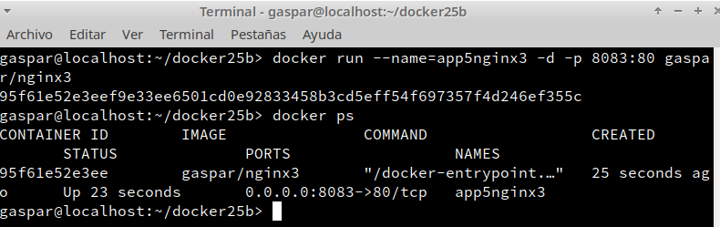

  * Comprobar el acceso a "holamundo3.html".

  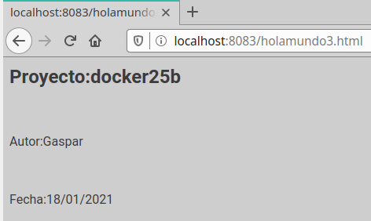

## 5. Docker Hub

  Ahora vamos a crear un contenedor "holamundo" y subirlo a Docker Hub.

  *Crear nuestra imagen "holamundo":

  * Crear carpeta `docker25c`. Entrar en la carpeta.
  * Crear un script (`holamundo25.sh`) con lo siguiente:

  ```
  #!/bin/sh
  echo "Hola Mundo!"
  echo "nombre-del-alumnoXX"
  echo "Proyecto dockerXXc"
  date
  ```

  Este script muestra varios mensajes por pantalla al ejecutarse.

  * Crear fichero Dockerfile

  ```
  FROM busybox
  MAINTAINER nombre-del-alumnoXX 1.0
  COPY holamundoXX.sh /root
  RUN chmod 755 /root/holamundoXX.sh
  CMD ["/root/holamundoXX.sh"]
  ```
  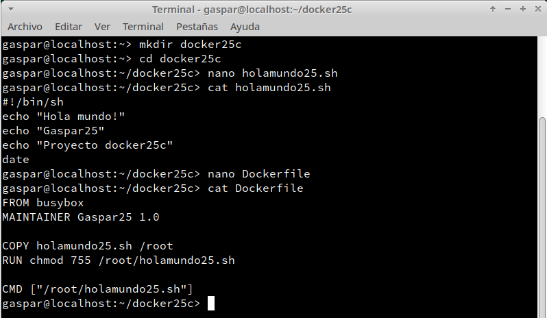

  * A partir del Dockerfile anterior crearemos la imagen `gaspar/holamundo`.

  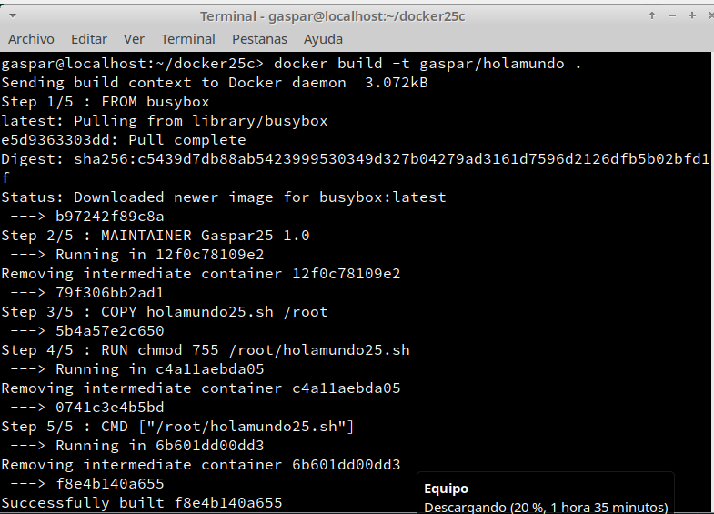

  * Comprobar que `docker run gaspar/holamundo` se crea un contenedor que ejecuta el script.

  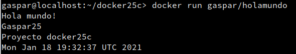

  * Ahora vamos a subir la imagen a Docker Hub:

  * Registrarse en Docker Hub, tendremos que entrar en la pagina oficial y registrarnos una vez hecho
  esto continuamos.

  * `docker login -u gaspar997`, para abrir la conexión.
  * `docker tag gaspar/holamundo:latest gaspar997/holamundo:version1`, etiquetamos la imagen con "version1".
  * `docker push gaspar997/holamundo:version1`, para subir la imagen (version1) a los repositorios de Docker.

  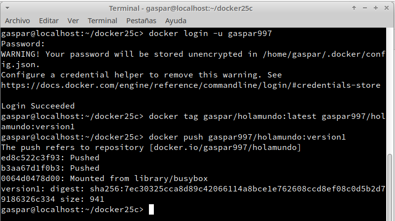

## 6. Limpiar contenedores e imágenes

  Cuando terminamos con los contenedores, y ya no lo necesitamos, es buena idea pararlos y/o destruirlos.

  * `docker ps -a`, identificar todos los contenedores que tenemos.
  * `docker stop ...`, parar todos los contenedores.
  * `docker rm ...`, eliminar los contenedores.

    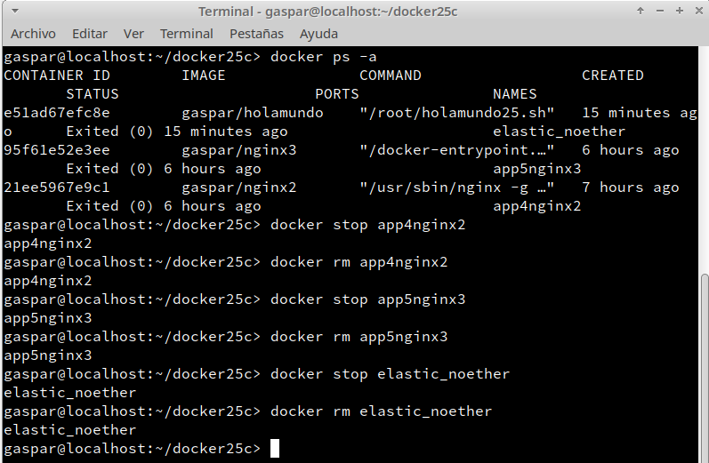

  Hacemos lo mismo con las imágenes. Como ya no las necesitamos las eliminamos:

  * `docker images`, identificar todas las imágenes.
  * `docker rmi ...`, eliminar las imágenes.

    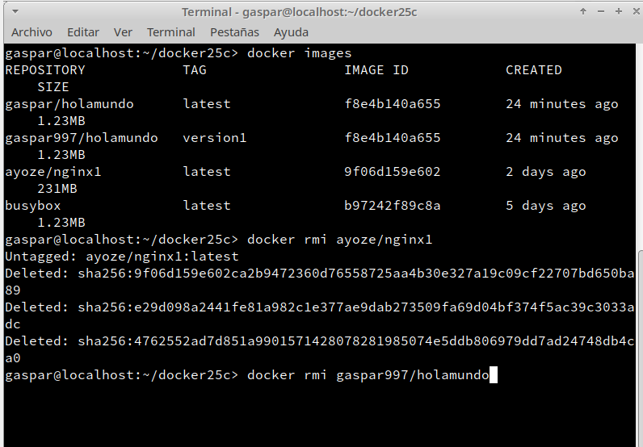

    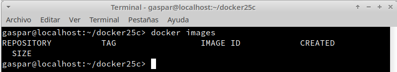

---
