## Tema 5
# Salt-Stack
## 1. Preparartivos
* En esta actividad utilizaremos 2 mv OpenSuse, que se llamarán Maestro y Minion:

* Nombre de la MV Maestro:

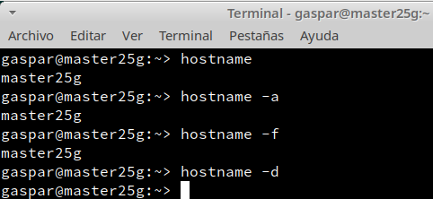

* Nombre de la MV Minion:

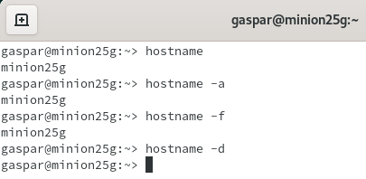

---
## 2. Master: Instalar y configurar
* Empezaremos instalando la herramienta `salt-master`.

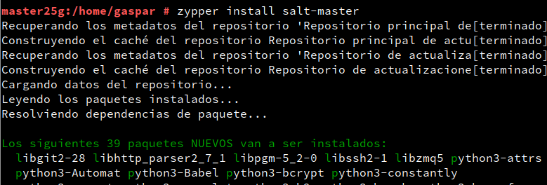

* Ahora al fichero `/etc/salt/master` le tendremos que añadir lo siguiente:

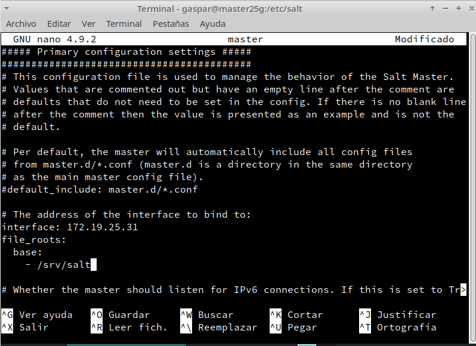

* Para activar el servicio en el arranque del sistema utilizaremos `systemctl enable salt-master.service`, y luego iniciamos el servicio con `systemctl start salt-master.service`. Una vez hecho estom, utilizaremos, `salt-key -L`, para asi comprobar si el minion a sido aceptao o no por nuestro Master y vemos que no hay ninguno.

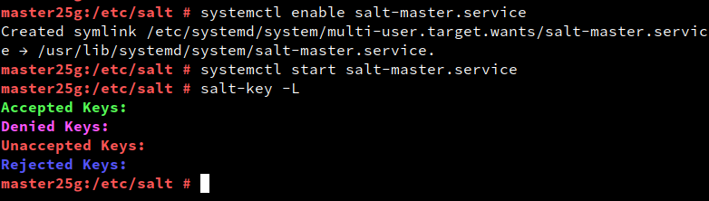

---

## 3. Minion
### 3.1 Instalación y configuración
* Instalamos el software del minion.

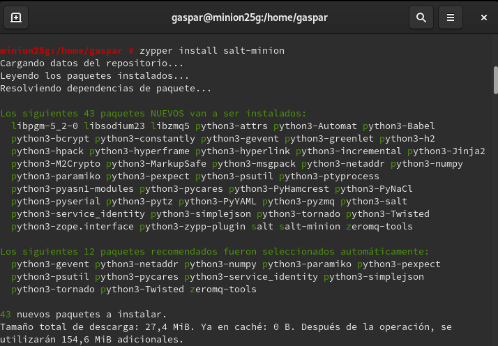

* Una vez instalado añadiremos la línea `master:172.19.25.31` al fichero `/etc/salt/minion`.

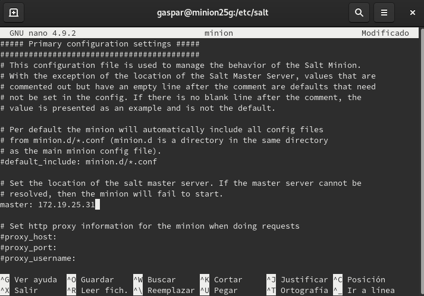

* Activamos el servicio en el arranque del sistema y lo iniciamos.

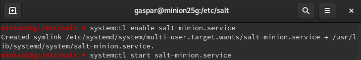

---
### 3.2 Cortafuegos
* Para este apartado en la máquina Master consultamos la zona de red, luego abrimos el puerto de forma permanente en la zona "public", una vez hecho esto reiniciamos el cortafuegos y por último comprobamos la configuración de la zona public.

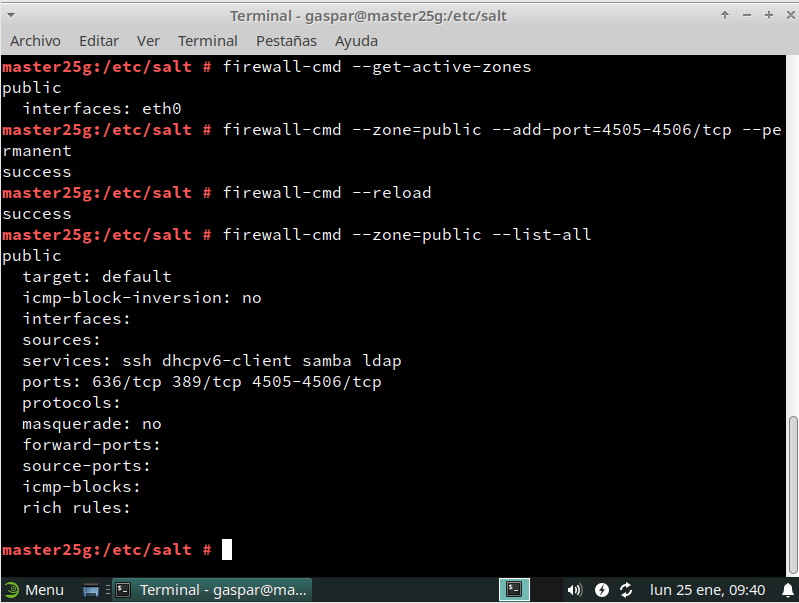
---
### 3.3 Aceptación desde el Master
* Una vez hecho el apartado anterior vamos a probar con lo siguiente `salt-key -L`  como se puede observar, el Master recibe la petición del Minion, la aceptamos y comprobamos de nuevo.

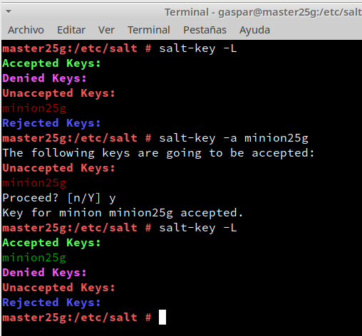
---
### 3.4 Comprobamos conectividad
* `salt '*' test.ping` conprobamos la conectividad y luego `salt '*' test.version` para comprobar la versión de Salt instalada en el Minion.

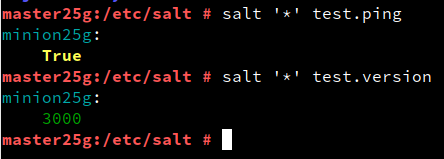

---
## 4. Salt States
### 4.1 Preparar el directorio para los estados
* Crear los directorios `/srv/salt/base` y `/srv/salt/devel`, luego creamos el archivo `/etc/salt/master.d/roots.conf` con el siguiente contenido:

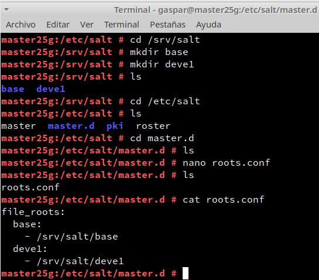

* Reiniciamos el servicio.

### 4.2 Crear un nuevo estado
* Creamos el fichero `/srv/salt/base/apache/init.sls` con el siguiente contenido:

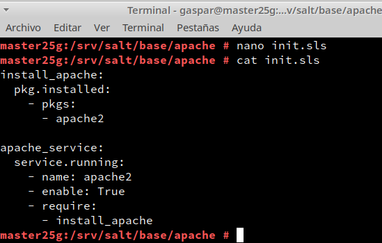

### 4.3 Asociar Minions a estados
* Ahora crearemos el fichero `/srv/salt/base/top.sls`, el cual asocia el estado que acabamos de crear con el minion.

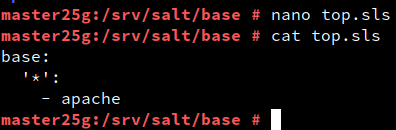

### 4.4 Comprobar: estados definidos
* Consultamos los estados que tenemos definidos para cada minion.

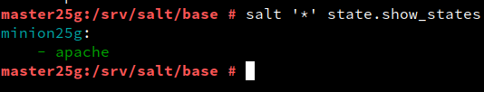

### 4.5 Aplicar el nuevo estado
**En el Master:**
* Consultamos los estados en detalle para verificar que no hay errores en las definiciones:

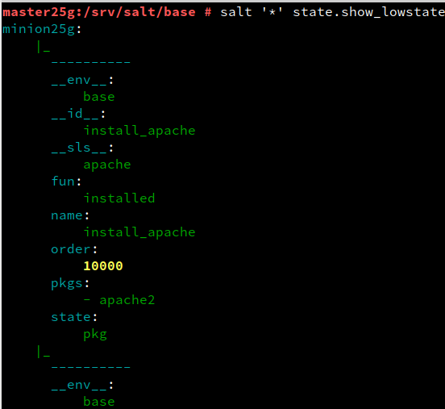

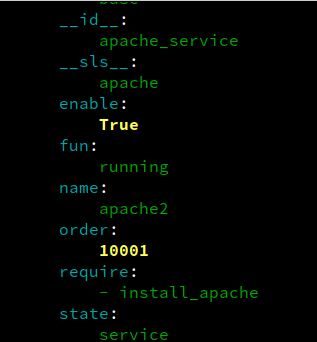

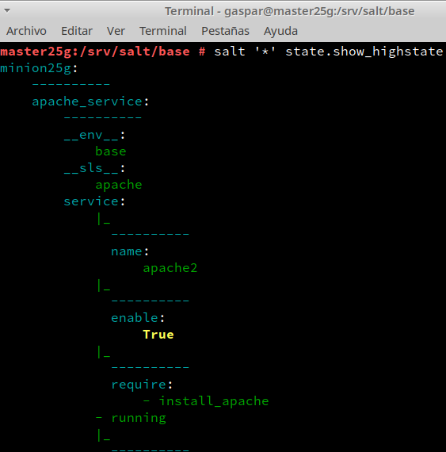

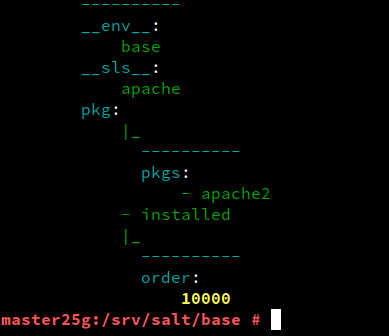

* Aplicamos el nuevo estado en todos los Minions con `salt '*' state.apply apache`.

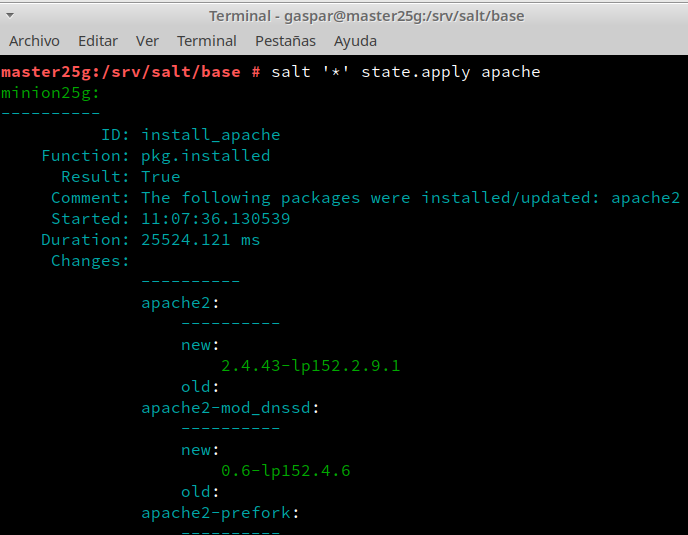

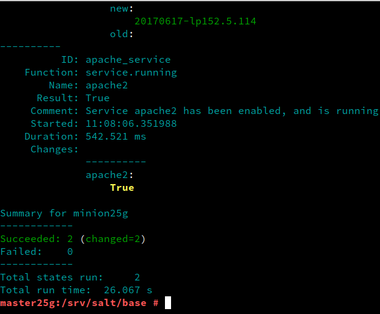
---

## 5. Crear más estados
### 5.1 Crear estado "users"
* Creamos el directorio `/srv/salt/base/users`, y el archivo `init.sls` con el siguiente contenido.

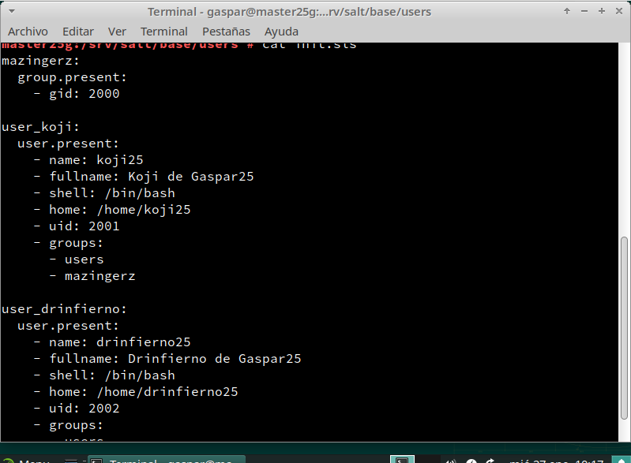

* Aplicamos el estado.

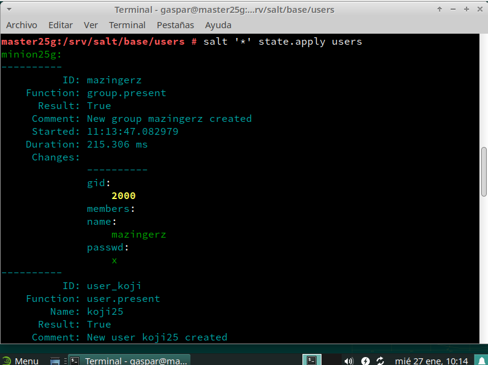

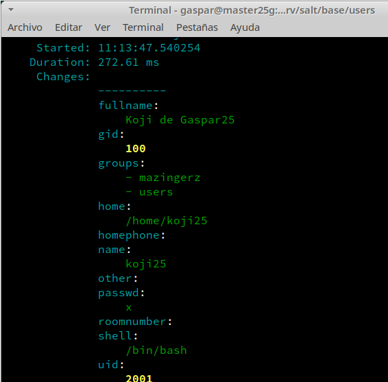

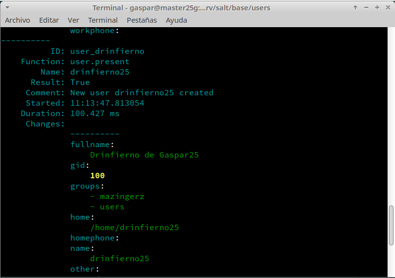

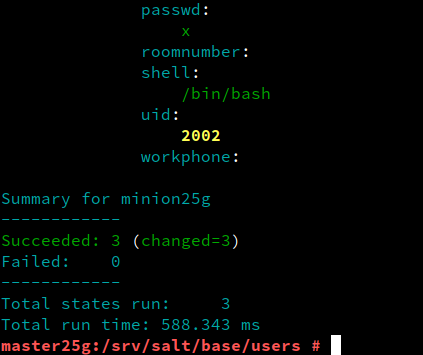

---
### 5.2 Crear estado "archivos"
* Ahora tendremos que crear el estado `archivos`. Dentro del estado, crear el archivo `init.sls` con el siguiente contenido:

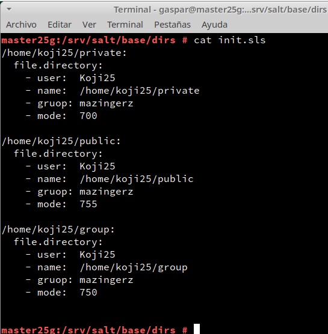

* Aplicamos el estado.

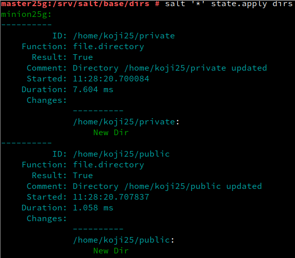

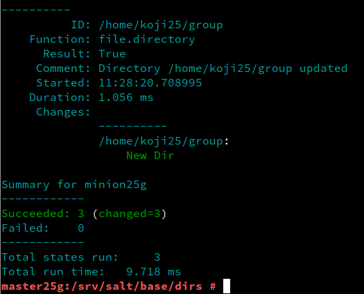

### 5.3 Ampliar estado "apache"
* Creamos el fichero `/srv/salt/files/holamundo.html`

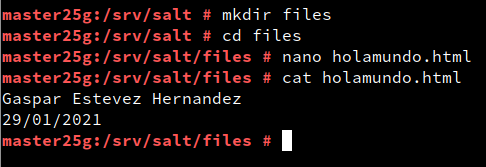

* Incluimos la creación del fichero `holamundo.html` en el estado `apache`.

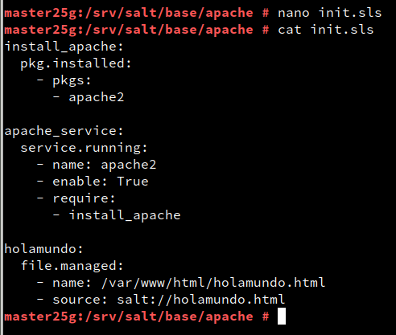

* Aplicamos el estado.(daba error)

* No consegui hacer este paso debido a que no se me abria la MV Master en mi casa y no pude terminarla, pero pongo hasta donde nos habiamos quedado en la ultima clase, tristemente no pude probar si funcionaba con mis propias manos, pero por medio de mis compañeros consegui saber que si funciona.
